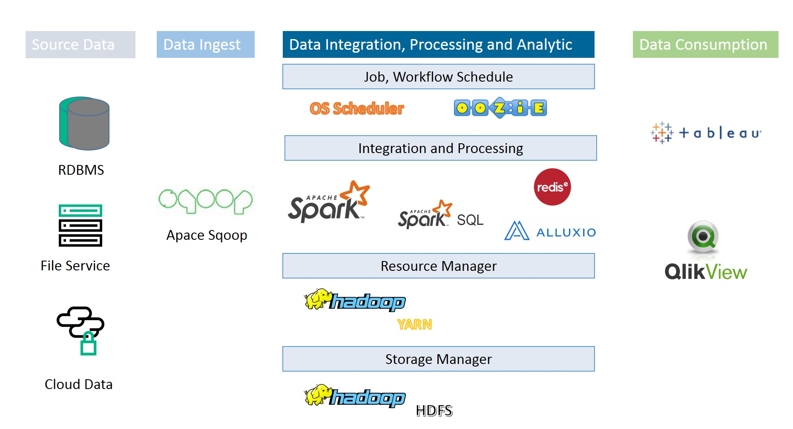

# MKR GDC DEV BigData POC

### Table of Contents

* <a href="#Goal">Goal</a>
* <a href="#Architecture">Architecture</a>
* <a href="#Data Flow">Data Flow</a>
    * <a href="#Batch Processing">Batch Processing</a>
* <a href="#Scope">Scope</a>
* <a href="#Lab Environment">Lab Environment</a>
   * <a href="#Cluser Information">Cluser Information</a>
   * <a href="#Service Web UIs">Service Web UIs</a>

---

## Goal
This POC wse setup for Merkler GDC techology guys to learning and pratice more about new techology. For the Big Data ecosystem.

Goal Phase I (Duration: Start from 2/27/2017 to ??):
* Batching load.
* Work out a stable and efficient solution for batch load based on SparkSQL.
* Implement one typical fact table using SparkSQL, and test performance

Goal Phase II 

## Architecture
### Batch Processing

## Data Flow
In this section, we will explain overall data flow for both batch and streaming processing.

### Batch Processing

## Scope

## Lab Environment

### Cluser Information

ServerName|Internal IP-|EIP           |External SSH|OS          |Disk(GB)|Memory(GB)
----------|------------|--------------|------------|------------|----|------
Master    |192.168.77.4|139.224.10.176|50022       |Ubuntu14.04||8
Slave1    |192.168.77.1|              |50122       |Ubuntu14.04||8
Slave2    |192.168.77.2|              |50222       |Ubuntu14.04||8
Slave3    |192.168.77.3|              |50322       |Ubuntu14.04||8
Slave4    |192.168.77.5|              |50522       |Ubuntu14.04||8

### Cluster Service Matrix

### Service Web UIs
Service Name | Server name		| URLs
-------------|----------------|-----------
Hadoop HFDS| hadoopmaster	|[HDFS](http://139.224.10.176:50070/dfshealth.html)
Hadoop Yarn| hadoopmaster	| [Yarn](http://139.224.10.176:8088/)
Apache Hue| hadoopmaster	|[Apache Hue](http://139.224.10.176:8000/beeswax)
Zookeeper|hadoopmaster|[Zookeeper]
HBase|hadoopmaster|[HBase]

